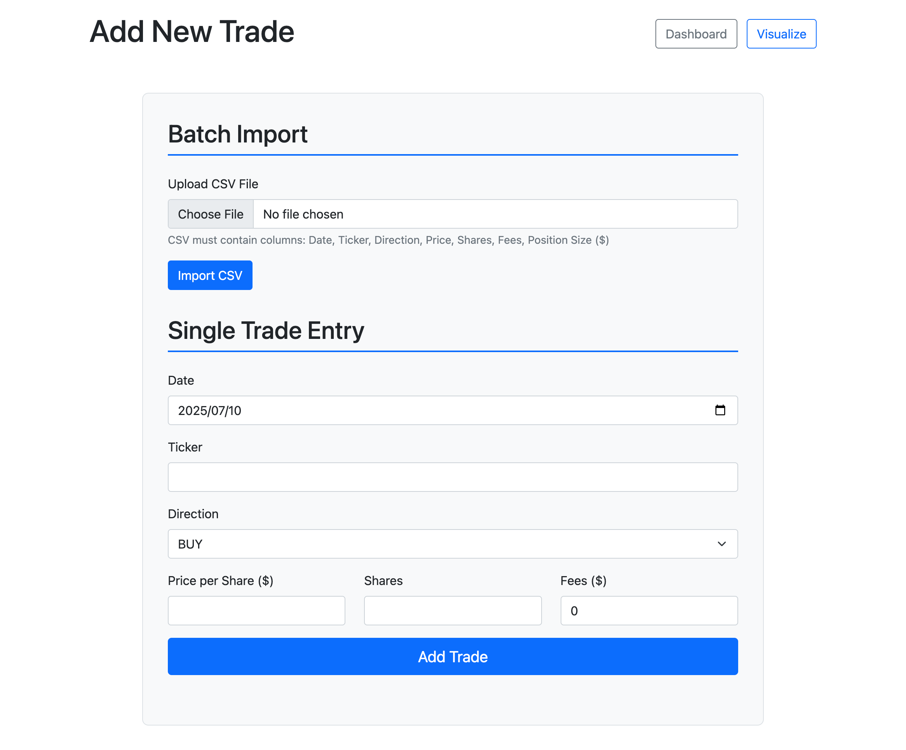
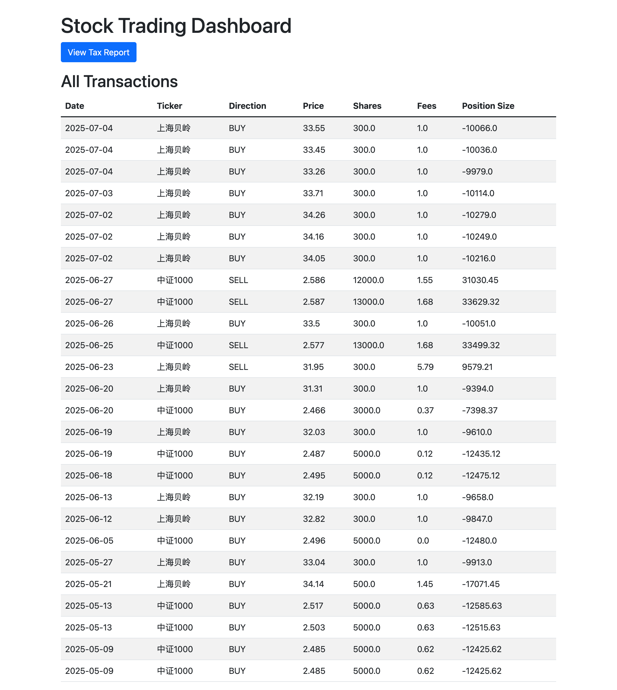
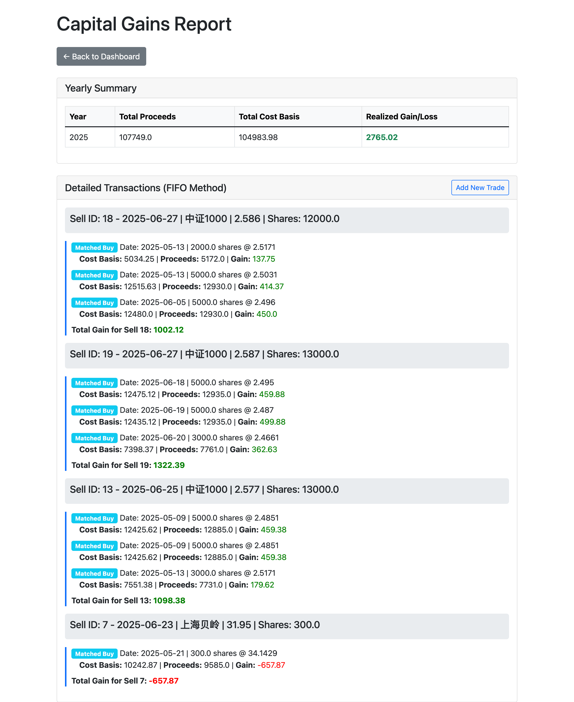
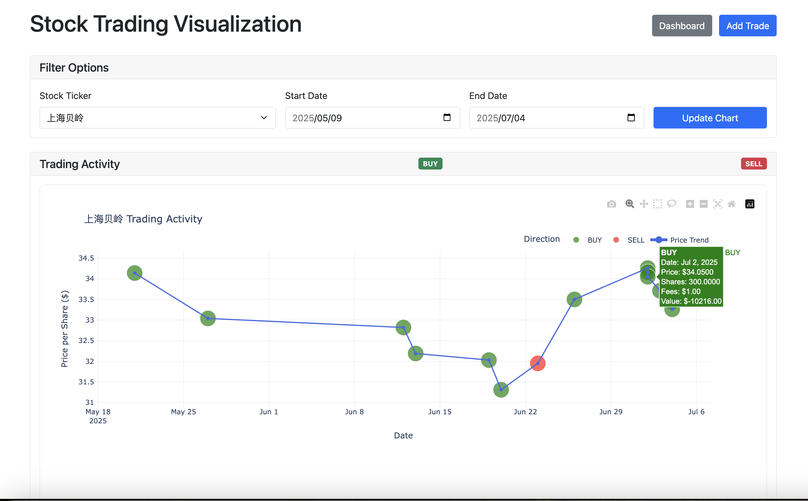

# Stocktax
As TAX bureau requires citizens to report their incomes in stock markets accordingly. In some countries like mainland China, citizens are still not familiar with how to calculate capital gains. This project is used to help people calculate their realized gains by years. It also try to help track your trading record. 
This project is created by AI and I only make some minor changes. So let's thank AI for make our life easier!
## Usage
### Installation
1. Create a python env, here I use conda. You can choose whatever you want.
```bash
conda create --name stock python=3.10
conda activate stock
conda install flask pandas plotly
```
2. Clone the project to your computer.
```bash
git clone https://github.com/yixingjia/stocktax.git
```
3. Prepare your stock trading data.
Create a csv file with the follow header.  All the data can be get from your stock vender. Please not I don't include the stock Dividends here. Since they are not neccessary with the realized gain cacualtion. 
```
Date,Ticker,Direction,Price,Shares,Fees,Position Size ($)
2025/5/21,上海贝岭,BUY,34.14,500,1.45,-17071.45
2025/5/27,上海贝岭,BUY,33.04,300,1,-9913
2025/6/27,中证1000,SELL,2.587,13000,1.68,33629.32
...
```
---
**NOTE**

Direction: BUY or SELL, its case sensitive.

Shares: The number of stock shares, fractal stock is supported.

Position Size ($): If BUY it equals 0 - Price * Shares - Fees, if SELL it equals Price * Share - Fees

---
4. Run the app

```bash
python app.py
```

5. Import your stock data
Open your browser and access [127.0.0.1:5000/add-trade](http://127.0.0.1:5000/add-trade)



You can batch import or add a single entry.

6. Visit home page
Click the ```Dashboard``` will direct you to the home page, you can verify if the data is properly imported. 


7. Visit the tax report page
This page will show the realized gains by years.



8. Stock trasanction by ticker


