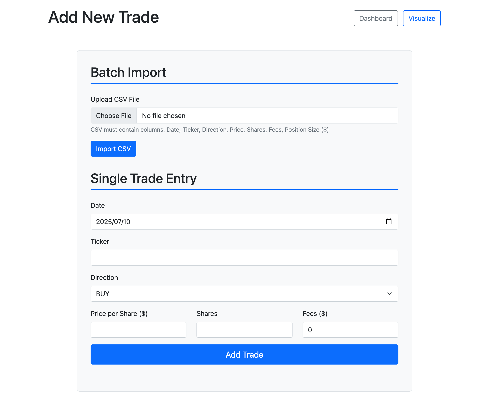
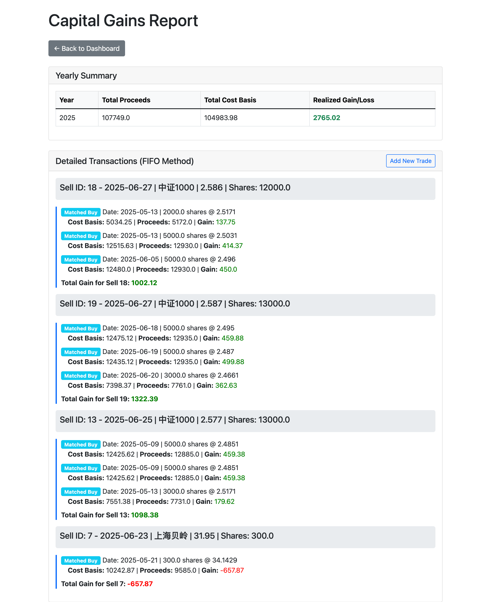
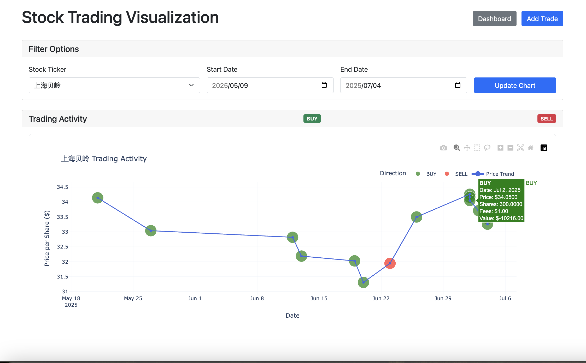

# 股票税
这个项目的主要目的是为了计算股票的已实现收益，一年为单位。其最终目的是让大家根据那啥的要求上交资本利得税，或者叫财产转让税。实现收益是不包含浮盈浮亏的，这里我们采用先进先出的策略来计算，这个也是法规的要求。

这个项目是我在AI的帮助下大概花了一个下午的时间， 非常感谢AI使new ma 生活变得更加容易！
## 使用方法
### 安装
1. 创建一个conda的虚拟python环境，我假设大家都会，实在不会的话，您也可以给我发消息，我有时间的话，会尽力回复的。
```bash
conda create --name stock python=3.10
conda activate stock
conda install flask pandas plotly
```
2. 克隆项目代码到本地
```bash
git clone https://github.com/yixingjia/stocktax.git
```
3. 准备你的股票交易数据
这一步需要您从您的股票交易商那里去的您的交易数据， 主要包括买入，卖出股票的数据。 其它的数据不需要。因为股票分红的报税是单独计算的，所以这里不需要。
把所有数据放在一个csv格式的文件中，如下所示。 
```
Date,Ticker,Direction,Price,Shares,Fees,Position Size ($)
2025/5/21,上海贝岭,BUY,34.14,500,1.45,-17071.45
2025/5/27,上海贝岭,BUY,33.04,300,1,-9913
2025/6/27,中证1000,SELL,2.587,13000,1.68,33629.32
...
```
---
**NOTE**

Direction: BUY or SELL, 即买入或卖出，必须是BUY（买入） 或者SELL（卖出），时间有限没有实现中文支持，大家先凑合着用吧。

Shares: 交易股票的数量，支持小数股票。很多市场支持小数股票交易，所以也加上了。

Position Size ($): 计算公式如下，如果是买入的话，它等于 0 - Price * Shares - Fees， 它是一个负数 相当于买入价格加上买入费用之和取负。 如果是卖出 Price * Shares - Fees 相当于卖出价格减去费用。  

---
4. 运行程序

```bash
python app.py
```

5. 导入数据
打开您的浏览器访问 [127.0.0.1:5000/add-trade](http://127.0.0.1:5000/add-trade)



您可以把第三步准备好的csv数据导入进来，您也可以一条一条的添加。

6. 查看导入的数据
点击  ```Dashboard``` 您可以简单对比一下看导入数据是否有误。


7. 访问实现盈利报告
您的实现收益会按照日历年分组显示。中国的话，您可以用 ```Realized Gain/Loss``` 对应的数字乘以 20% 报税。页面的下方展示的是详细的按照先进先出的策略如何计算的。



8. 股票交易活动日历


